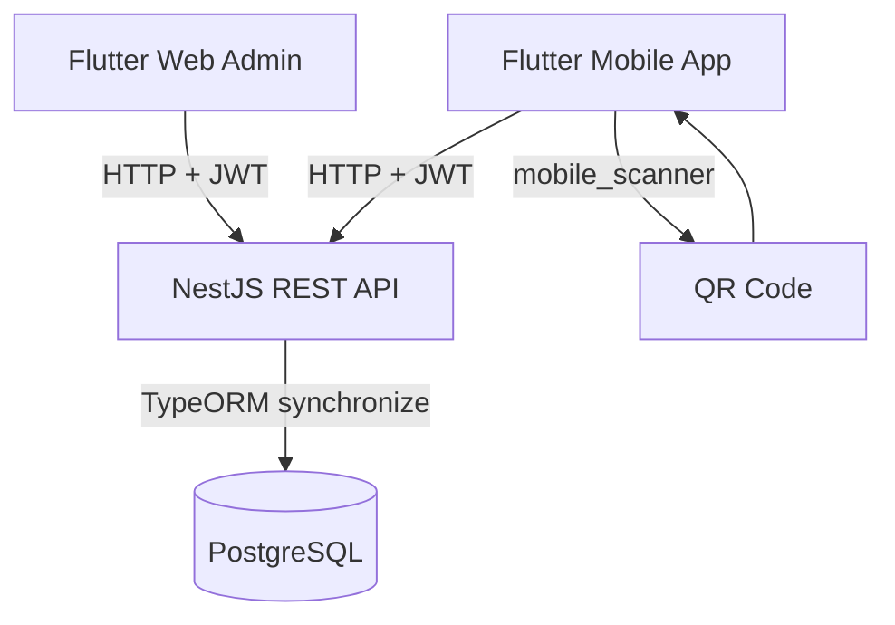

# True Root

True Root is a Flutter + NestJS supply-chain batch tracking system. It covers the full
batch lifecycle (create, update, split/merge/transform, archive/disqualify), QR-based
discovery, ownership transfer workflows, and an admin panel for managing users, products,
and stages.

## Architecture



**Tech stack:** Flutter · Riverpod · NestJS · TypeORM · PostgreSQL · mobile_scanner

## Quick Start

### Flutter (mobile/web)

```bash
flutter clean
flutter pub get
flutter run
```

### Flutter Web (admin panel)

```bash
flutter run -d chrome
# or
flutter run -d web-server --web-port 8080
```

### Regenerate launcher icons

```bash
flutter pub get
flutter pub run flutter_launcher_icons
```

### Regenerate splash assets

```bash
flutter pub get
flutter pub run flutter_native_splash:create
```

### Backend (NestJS API)

```bash
cd backend/api
npm install
npm run start:dev
```

### Database (Postgres)

```bash
# create DB/user
psql -U postgres -f sql/create_database.sql

# reset DB (dev)
psql -U postgres -f sql/reset_database.sql
```

## Project Structure

- `lib/` Flutter mobile + web app (splash, auth, dashboard, batches, requests, users, profile, admin, notifications).
- `backend/api/` NestJS API (auth, batches, batch-events, ownership-requests, users, products, stages, admin).
- `sql/` Database scripts (`create_database.sql`, `reset_database.sql`).
- `assets/` App icon and images.

## Demo Flow

1. Register or log in.
2. Create a batch (product, quantity, stage).
3. View batch details and QR code.
4. Scan a QR code to look up a batch.
5. Request ownership from a batch found via QR or the Users tab.
6. Approve or reject incoming requests from the Batches tab → Requests inbox.
7. Use the Admin panel (web, admin role only) to manage users, products, stages, and audit batch history.

## API Reference (Summary)

Base URL: `http://<host>:<port>`

Auth
- `POST /auth/login`
- `POST /auth/register`

Batches
- `POST /batches`
- `GET /batches` (limit, offset, ownerId, includeInactive)
- `GET /batches/:id`
- `PATCH /batches/:id/quantity`
- `PATCH /batches/:id/status`
- `PATCH /batches/:id/stage`
- `PATCH /batches/:id/grade`
- `PATCH /batches/:id/disqualify`
- `PATCH /batches/:id/archive`
- `DELETE /batches/:id`
- `POST /batches/:id/split`
- `POST /batches/merge`
- `POST /batches/:id/transform`
- `GET /batches/:id/history`
- `GET /batches/:id/qr`
- `GET /batches/:id/lineage`

Ownership Requests
- `POST /ownership-requests`
- `GET /ownership-requests/inbox?ownerId=`
- `GET /ownership-requests/outbox?requesterId=`
- `PATCH /ownership-requests/:id/approve`
- `PATCH /ownership-requests/:id/reject`

Users
- `GET /users`
- `GET /users/:id`
- `POST /users`
- `PATCH /users/:id`
- `DELETE /users/:id`

Products
- `GET /products`
- `POST /products`
- `PATCH /products/:id`
- `DELETE /products/:id`

Stages
- `GET /stages`
- `POST /stages`
- `PATCH /stages/:id`
- `DELETE /stages/:id`

Admin
- `GET /admin/overview`

Batch Events
- `GET /batch-events/recent?limit=&ownerId=`
- `GET /batch-events/:batchId`
